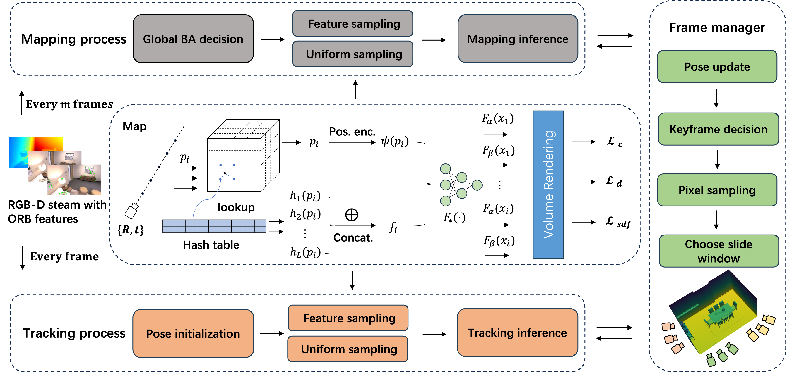

<p align="center">
  <h1 align="center">EC-SLAM: Effectively Constrained Neural RGB-D SLAM with Sparse TSDF Encoding and Global Bundle Adjustment</h1>
  <h1 align="center">[Arxiv Preprint]</h1>
  <p align="center">
    Guanghao Li*
    .
    Qi Chen*
    ·
    Yuxiang Yan*
    ·
    Jian Pu*
  </p>
  <p align="center"><strong>(* Equal Contribution)</strong></p>
  <h3 align="center"><a href="https://arxiv.org/abs/2404.13346">Paper</a> | <a href="https://github.com/Lightingooo/EC-SLAM">Project Page</a> 
  <div align="center"></div>
</p>

<p align="center">
  <a href="">
    
  </a>
</p>
<p align="left">
&nbsp;&nbsp;&nbsp;&nbsp;&nbsp;&nbsp;&nbsp;&nbsp;&nbsp;&nbsp;&nbsp;&nbsp;&nbsp;&nbsp;&nbsp;&nbsp;&nbsp;NICE_SLAM &nbsp;&nbsp;&nbsp;&nbsp;&nbsp;&nbsp;&nbsp;&nbsp;&nbsp; ESLAM &nbsp;&nbsp;&nbsp;&nbsp;&nbsp;&nbsp;&nbsp;&nbsp;&nbsp;&nbsp;&nbsp;Co-SLAM &nbsp;&nbsp;&nbsp;&nbsp;&nbsp;&nbsp;&nbsp;&nbsp;&nbsp;&nbsp;&nbsp;&nbsp;&nbsp;Ours &nbsp;&nbsp;&nbsp;&nbsp;&nbsp;&nbsp;&nbsp;&nbsp;&nbsp;&nbsp;&nbsp;&nbsp;&nbsp;&nbsp;&nbsp;&nbsp;&nbsp;&nbsp;GT 
</p>  
<p align="center">
EC-SLAM produces accurate dense geometry and camera tracking on large-scale indoor scenes.
</p>  

<p align="center">
  <a href="">
    
  </a>
</p>

<p align="center">
EC-SLAM Architecture.
</p>

## Abstract
We introduce EC-SLAM, a real-time dense RGB-D simultaneous localization and mapping (SLAM) system leveraging Neural Radiance Fields (NeRF). While recent NeRF-based SLAM systems have shown promising results, they have yet to fully exploit NeRF's potential to constrain pose optimization. EC-SLAM addresses this by using sparse parametric encodings and Truncated Signed Distance Fields (TSDF) to represent the map, enabling efficient fusion, reducing model parameters, and accelerating convergence. Our system also employs a globally constrained Bundle Adjustment (BA) strategy that capitalizes on NeRF's implicit loop closure correction capability, improving tracking accuracy by reinforcing constraints on keyframes most relevant to the current optimized frame. Furthermore, by integrating a feature-based and uniform sampling strategy that minimizes ineffective constraint points for pose optimization, we reduce the impact of random sampling in NeRF. Extensive evaluations on the Replica, ScanNet, and TUM datasets demonstrate state-of-the-art performance, including enhanced reconstruction accuracy due to precise pose estimation, real-time operation at 21 Hz, and tracking precision improvements of up to 50\%. 

## 🔨 Running and Evaluating EC-SLAM

Here we elaborate on how to load the necessary data, configure EC-SLAM for your use-case, 
debug it, and how to reproduce the results mentioned in the paper.

  <details>
  <summary><b>Downloading the Data</b></summary>
  For downloading Replica, follow the procedure described on <a href="https://github.com/kxhit/vMAP">vmap</a>.<br>
  </details>

  <details>
  <summary><b>Running the code</b></summary>
  Start the system with the command:

  ```
  python run.py configs/<dataset_name>/<config_name>
  ```
  For example:
  ```
  python run.py configs/Replica/room0.yaml
  ```
  </details> 

  <details>
  <summary><b>Evaluating</b></summary>
    After running the code, you can see output/dataset_name/ for results.
  </details>

## Acknowledgement
Our codebase is based on [Co-SLAM]([https://github.com/eriksandstroem/Point-SLAM](https://github.com/HengyiWang/Co-SLAM)).

## Reproducibility
There may be minor differences between the released codebase and the results reported in the paper. Further, we note that the GPU hardware has an influence, despite running the same seed and conda environment.

## Citation

If you find our code or paper useful, please cite
```bibtex
@article{li2024ec,
  title={EC-SLAM: Real-time Dense Neural RGB-D SLAM System with Effectively Constrained Global Bundle Adjustment},
  author={Li, Guanghao and Chen, Qi and Yan, YuXiang and Pu, Jian},
  journal={arXiv preprint arXiv:2404.13346},
  year={2024}
}
```
## Contact
Contact [Guanghao Li](ghli22@m.fudan.edu.cn) for questions, comments and reporting bugs.
